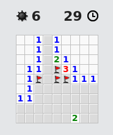

# Campus In The Alps: Algo Démineur

Le but de cet exercice est de générer le terrain du démineur seulement, pas de réaliser l'interface du jeu !

## étape 1: Initialisation

- Cloner le projet
- Importer le projet dans votre IDE
- Lancer l'exécution des tests unitaires du fichier DemineurTest.java, ils sont tous en rouge

## étape 2: Générer le démineur, avec le positionement des bombes et des cases vides.

Il n'est pas évident de positionner de façon aléatoire les bombes, en respectant la contrainte du nombre demandé.
Car si on veut avoir par exemple 50 bombes sur un démineur en 10x10 (100 cases), il y a de forte chance pour que l'on tire de façon aléatoire plusieurs fois la même position pour une bombe.

On peut faire cette génération en deux temps :
- d'abord créer toutes les bombes avec leurs coordonnées
- ensuite remplir le terrain du démineur, avec ces bombes et des cases vides

En Java, les `java.util.Set` servent à contenir un ensemble **unique** d'objets. On peut donc se servir de cette collection pour nous aider dans la première étape, via une boucle comme celle-ci :

    Set<BombCase> bombes = new HashSet<>(); // création d'un ensemble unique de bombes
    while (bombes.size() < 10) {            // tant que mon ensemble contient moins que 10 bombes 
       bombes.add(...);                     // j'ajoute une bombe à mon ensemble, si une même bombes existe déjà elle ne sera pas ajoutée mais remplacée
    }

Java utilise les méthodes `hashCode` et `equals` de la classe `Object` pour déterminer quand deux objets sont égaux entre eux. Vous allez donc devoir implémenter ces méthodes dans les classes voulues pour que le `Set` de `bombes` ne puisse pas contenir deux éléments sur la même coordonnée.

## étape 3: Savoir compter le nombre de case bombes qui entour une autre case.

Implémenter le code de la méthode `countBombsAround` pour faire passer les tests `shouldCountAllBombsAroundWhenNone` et `shouldCountAllBombsAroundWhenSome`.

## étape 4: Savoir déssiner la board

Implémenter le code de la méthode `boardAsString` pour faire passer le test `shouldDisplayTheBoardWithBombsAndCount`

